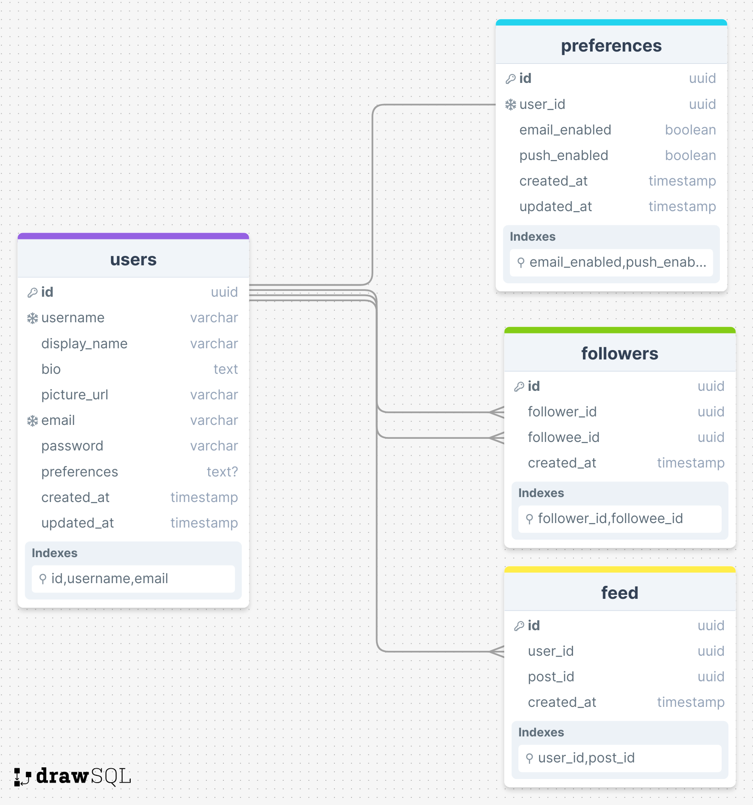
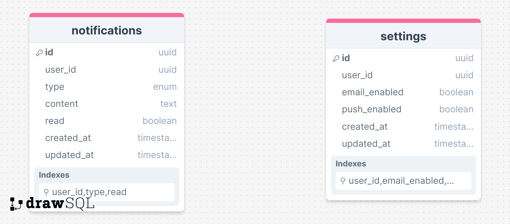

# Database Schema

This document outlines the database schema for a scalable real-time notification system. The system consists of three main services: User Service, Post Service, and Notification Service. Each service has its own database schema to store relevant data.

## 1. User Service

The User Service manages user accounts and preferences. This users PostgreSQL as the database. The database schema for the User Service includes the following tables:

### Users

The `Users` table stores user account information, including user ID, username, email, password hash, and other details.

| Column       | Type      | Description                |
| ------------ | --------- | -------------------------- |
| id           | UUID      | Unique user ID             |
| username     | VARCHAR   | User's username            |
| display_name | VARCHAR   | User's display name        |
| bio          | TEXT      | User's bio/description     |
| picture_url  | VARCHAR   | URL to profile picture     |
| email        | VARCHAR   | User's email address       |
| password     | VARCHAR   | Hashed user password       |
| preferences  | TEXT[]    | User preferences(tags)     |
| created_at   | TIMESTAMP | Account creation timestamp |
| updated_at   | TIMESTAMP | Last update timestamp      |

### Preferences

The `Preferences` table stores user notification preferences, such as notification types (e.g., email, push notifications) and delivery channels.

| Column        | Type      | Description                        |
| ------------- | --------- | ---------------------------------- |
| id            | UUID      | Unique preference ID               |
| user_id       | UUID      | Foreign key: User ID               |
| email_enabled | BOOLEAN   | Enable/disable email notifications |
| push_enabled  | BOOLEAN   | Enable/disable push notifications  |
| created_at    | TIMESTAMP | Preference creation timestamp      |
| updated_at    | TIMESTAMP | Last update timestamp              |

### Followers

The `Followers` table stores user follow relationships, indicating which users are following each other.

| Column      | Type      | Description                   |
| ----------- | --------- | ----------------------------- |
| id          | UUID      | Unique follow ID              |
| follower_id | UUID      | Foreign key: Follower user ID |
| followee_id | UUID      | Foreign key: Followee user ID |
| created_at  | TIMESTAMP | Follow relationship timestamp |

### Feed

The `Feed` table stores posts from users followed by a specific user, allowing users to view a personalized feed of posts.

| Column     | Type      | Description                        |
| ---------- | --------- | ---------------------------------- |
| id         | UUID      | Unique feed ID                     |
| user_id    | UUID      | Foreign key: User ID (foreign key) |
| post_id    | UUID      | Post ID (foreign key)              |
| created_at | TIMESTAMP | Feed entry timestamp               |

### Benefits of Using a Relational Database (e.g., PostgreSQL) for Users

- Relational databases provide strong data consistency and integrity through ACID transactions.
- They support complex queries and relationships between entities, such as user-follow relationships and personalized feeds.
- Relational databases are well-suited for structured data and complex queries required for user management and preferences.



## 2. Post Service

The Post Service handles the creation, storage, retrieval, and deletion of posts and comments. The database schema for the Post Service includes the following tables:

```json
{
  "_id": ObjectId("..."), // Unique identifier for the document (generated by MongoDB)
  "content": "...", // Post content
  "tags": [...], // Array of strings for tags
  "image_url": "...", // URL to post image
  "visibility": "...", // Post visibility (e.g., public, private)
  "created_at": ISODate("..."), // Use ISO format for timestamps
  "updated_at": ISODate("..."),
  "author": {
    "user_id": ObjectId("..."), // Reference to the user document
  },
  "comments": [
    {
      "_id": ObjectId("..."), // Unique identifier for the comment
      "content": "...", // Comment content
      "created_at": ISODate("..."), // Comment creation timestamp
      "updated_at": ISODate("..."), // Last update timestamp
      "author": {
        "user_id": ObjectId("..."), // Reference to the user document
      },
    },
    // ... more comments
  ],
  "likes": [
    {
      "user_id": ObjectId("..."), // Reference to the user document
      "created_at": ISODate("..."), // Like timestamp
    },
    // ... more likes
  ],
  "shares": [
    {
      "user_id": ObjectId("..."), // Reference to the user document
      "created_at": ISODate("..."), // Share timestamp
    },
    // ... more shares
  ]
}
```

### Benefits of Using a Document Database (e.g., MongoDB) for Posts

- This structure simplifies queries as you can retrieve all post information, including comments, likes, and shares, in a single document lookup.
- It reduces the need for complex joins between separate tables.
- It scales well horizontally as you can add more documents without impacting performance on existing ones.

## 3. Notification Service

The Notification Service generates and delivers real-time notifications to users. The database schema for the Notification Service includes the following tables:

### Notifications

The `Notifications` table stores notification information, including notification ID, user ID (recipient), notification type, content, and delivery status.

| Column     | Type      | Description                |
| ---------- | --------- | -------------------------- |
| id         | UUID      | Unique notification ID     |
| user_id    | UUID      | User ID (foreign key)      |
| type       | ENUM      | Notification type          |
| content    | TEXT      | Notification content       |
| read       | BOOLEAN   | Read status                |
| created_at | TIMESTAMP | Notification creation time |
| updated_at | TIMESTAMP | Last update timestamp      |

### Settings

The `Settings` table stores user notification settings, allowing users to customize their notification preferences.

| Column        | Type      | Description                        |
| ------------- | --------- | ---------------------------------- |
| id            | UUID      | Unique settings ID                 |
| user_id       | UUID      | User ID (foreign key)              |
| email_enabled | BOOLEAN   | Enable/disable email notifications |
| push_enabled  | BOOLEAN   | Enable/disable push notifications  |
| created_at    | TIMESTAMP | Settings creation timestamp        |
| updated_at    | TIMESTAMP | Last update timestamp              |



## 4. Message Broker (RabbitMQ)

The Message Broker handles asynchronous communication between services by publishing and consuming messages. The system uses RabbitMQ as the message broker to facilitate real-time notifications and data synchronization.

The message broker enables the User Service and Post Service to publish events such as user follows and new posts/comments. The Notification Service consumes these events to generate and deliver real-time notifications to users based on their preferences and activity.

By utilizing a message broker, the system ensures reliable message delivery, decoupling of services, and scalability for handling a large number of notifications and user interactions.

This database schema provides a foundation for building a scalable real-time notification system that can handle user interactions, post creation, and notification delivery efficiently. By designing the database schema with scalability and performance in mind, the system can support a growing user base and deliver real-time notifications effectively.
