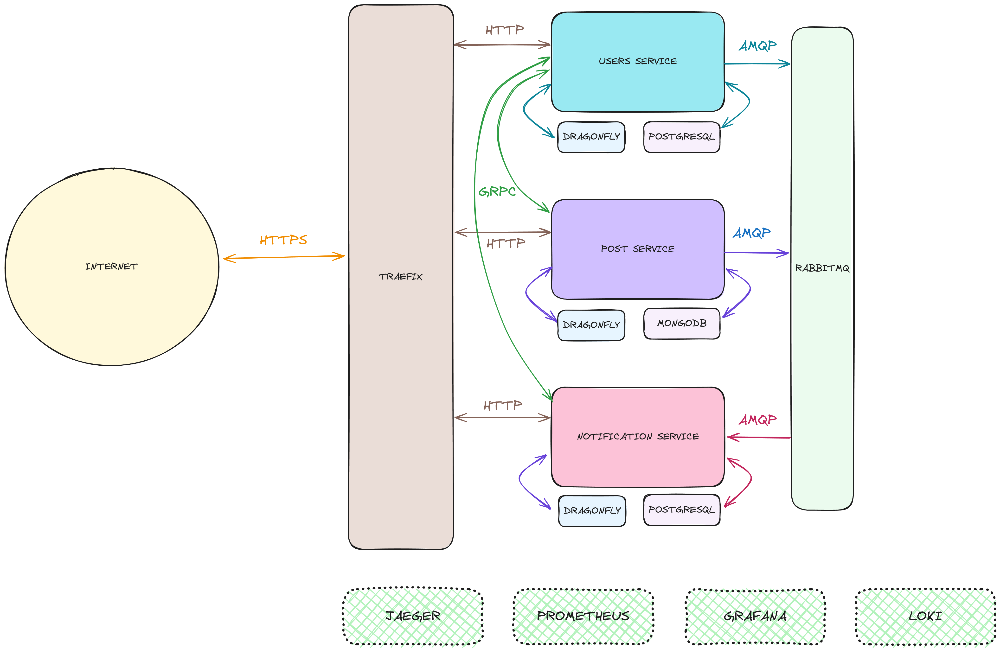

# System Design

The system will be designed as a collection of independent microservices that communicate via APIs. The following microservices will be implemented:

- **User Service**: Manages user accounts and profiles.
- **Post Service**: Handles creation, storage, and retrieval of posts.
- **Notification Service**: Generates and delivers real-time notifications to users.
- **Message Broker**: Utilizes RabbitMQ for asynchronous communication between services.

## 1. User Service

- Manages user accounts, profiles, and preferences (including notification settings).
- Has a cache to store user information for faster retrieval.

## 2. Post Service

- Handles creation, storage, retrieval, and deletion of posts and comments.
- Has a cache to store post information for faster retrieval.

## 3. Notification Service

- Generates and delivers real-time notifications to users based on their preferences and activity.
- Consumes messages from message brokers published by User Service (user follows) and Post Service (new post/comment).
- Uses web sockets or server-sent events (SSE) for real-time delivery.

## 4. Message Broker (Kafka/RabbitMQ)

- Enables asynchronous communication between microservices.
  User Service and Post Service publish events to the message broker.
- Notification Service subscribes to relevant topics in the message broker to receive updates.

